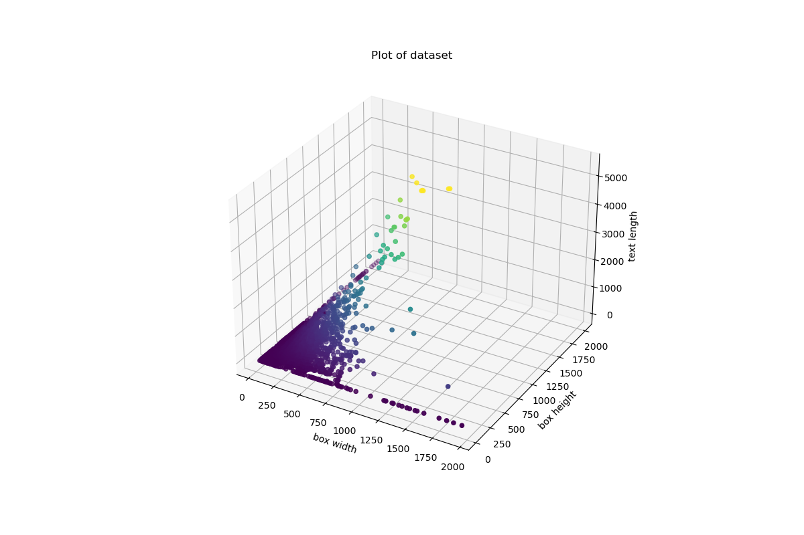
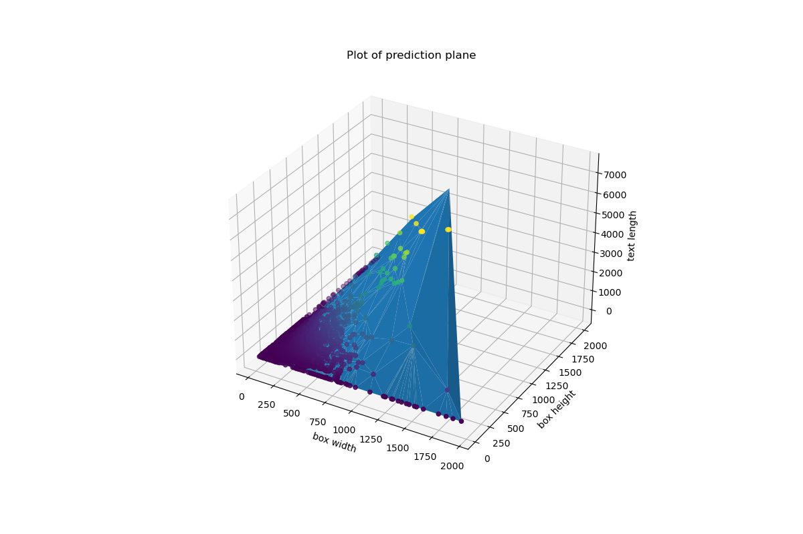

# linear-regression-for-text-length

#### Linear regression for **text length**, given an `html 
` of <u>known width, height and given the text style</u>

This work solves a problem I faced while developing a web application requiring the efficient computation of the maximum text length that would fit a given html `
`. I firstly developed a really naive and inefficient algorithm that allowed me to collect some data. Then, I used that data to train a linear regression model that gave me the coefficients to predict the quantity I needed in constant time.

Dataset | Prediction Plane
--- | ---
 |

# Demo

  
Click to see the code in action!

  
  

